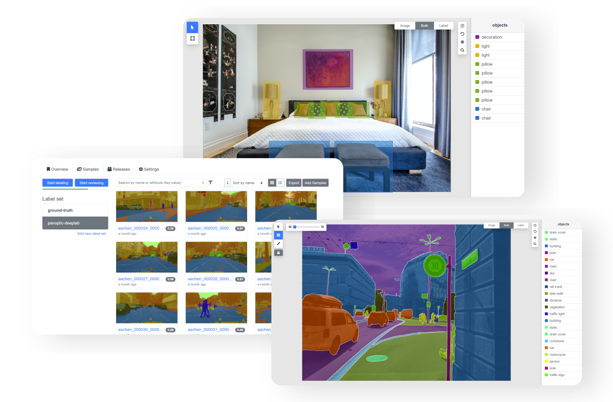

# Introduction

Segments.ai is the training data platform for computer vision engineers and labeling teams. Our powerful labeling interfaces, easy-to-use management features, and extensive API integrations help you iterate quickly between data labeling, model training and failure case discovery.

These docs describe how you can use our [API](api.md) and [Python SDK](python-sdk.md) to programmatically manage datasets, samples and labels, and how you can export your data once labeled.

