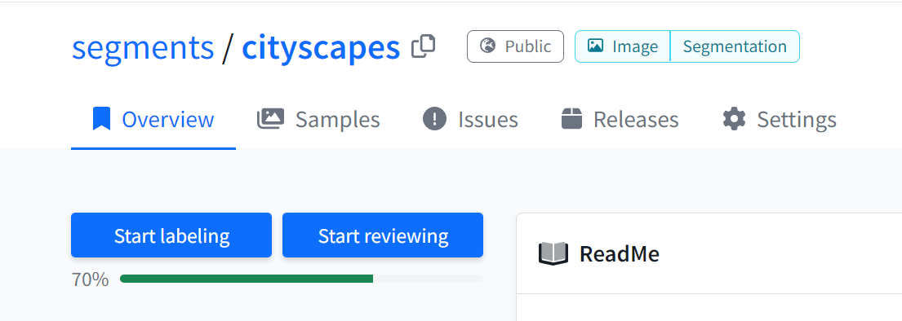

# Label queue mechanics


Note that a single [sample ](main-concepts.md#sample)can either be an _individual image_ or an _image sequence consisting of multiple frames_, depending on the chosen dataset type. Same for point cloud data.


When you upload a new sample, its initial status is _unlabeled_. Samples are always either _unlabeled_, _prelabeled_, _labeled (or labeling in progress)_, _reviewed (or reviewing in progress)_, _rejected_, or _skipped_.

Dataset **administrators** can open any sample directly via the _Samples_ tab. They can update the label and freely change the label status.

Dataset **labelers and reviewers** don't have access to the _Samples_ tab. They can only click the blue _Start labeling_ or _Start reviewing_ buttons. This brings them in a workflow where they are automatically assigned samples from the label or review queue in a certain order, as explained below.

<figure><figcaption>
'Start Labeling' and 'Start Reviewing' workflows
</figcaption></figure>

### Label queue

When a labeler presses the _Start labeling_ button, a single sample is fetched from the label queue.&#x20;

In the labeling workflow, there are three buttons:

* **Submit**: set the sample status to _labeled (_&#x6D;oving it to the review queue) and go to the next sample in the queue.
* **Skip**: set the sample status to _skipped_ and go to the next sample in the queue.
* **Save** _(only visible if enabled in the dataset settings)_: set the sample status to _labeling in progress_ but don't go to the next sample in the queue yet. Can be helpful when labeling larger samples.

If a labeler presses the "Start labeling" button, they will get samples from the label queue in this order:

1. Samples which they started labeling but didn't finish yet. Only if the _save_ button is enabled.
2. Samples they labeled but which were rejected in the reviewing step, and now need to be corrected.
3. Unlabeled or prelabeled samples which are [specifically assigned](../guides/customize-label-queue.md#assign-a-specific-labeler-or-reviewer) to this user, through the `assigned_labeler` field.
4. Unlabeled or prelabeled samples which are not assigned to a specific user.
5. If no such samples exist, the label queue is empty and no more samples need to be labeled.

Within each step, samples with higher priority are returned first. Read more about how you can [customize the queue priority](../guides/customize-label-queue.md).

### Review queue

When you press the _Start reviewing_ button, a single sample is fetched from the review queue.&#x20;

In the reviewing workflow, there are four buttons:

* **Accept**: set the sample status to _reviewed_.
* **Reject**: set the sample status to _rejected_, moving it back onto the label queue.
* **Skip** _(only visible if enabled in the dataset settings)_: set the sample status to _skipped_.
* **Save** _(only visible if enabled in the dataset settings)_: set the sample status to _reviewing in progress_ but don't go to the next sample in the review queue yet. Can be helpful when reviewing larger samples.

If a reviewer presses the _Start reviewing_ button, they will get samples from the review queue in this order:

1. Samples which they started reviewing but didn't finish yet. Only if the save button is enabled.
2. Samples they rejected before and have now been corrected by the original labeler, so they need to be reviewed again.
3. Labeled samples which are [specifically assigned](../guides/customize-label-queue.md#assign-a-specific-labeler-or-reviewer) to this user, through the `assigned_reviewer` field.
4. Labeled samples which are not assigned to a specific user, and which haven’t been labeled by this user (to avoid reviewing their own labeled samples if a team participates in both labeling and reviewing).
5. Labeled samples which are not assigned to a specific user, independent of who labeled them before (to prevent deadlock if a single user wants to both label and review a dataset).
6. If no such samples exist, the review queue is empty and no more samples need to be reviewed.

Within each step, samples with higher priority are returned first. For samples with the same priority, the oldest one is returned first. Read more about how you can [customize the queue priority](../guides/customize-label-queue.md#set-sample-priority).
