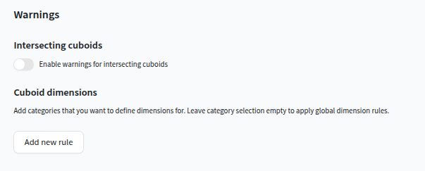
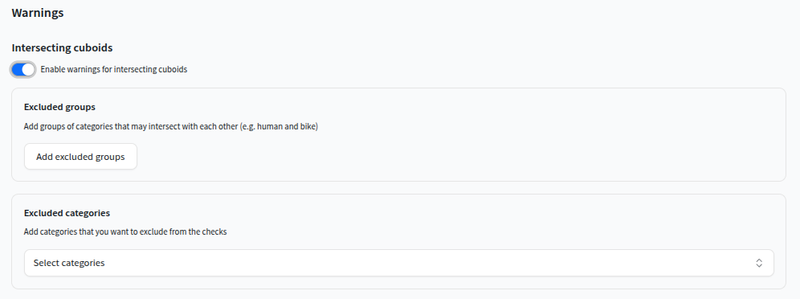
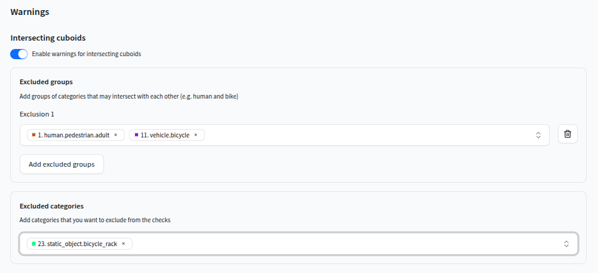
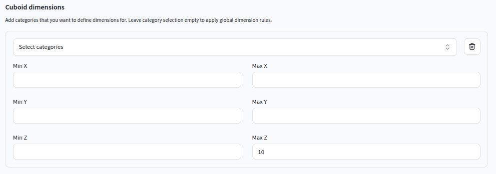

# Configure rules


[More info about how to use the warning system while labeling / reviewing](../../how-to-annotate/use-the-warning-system.md)


## Configuration

Go to your dataset settings into the labeling tab. Scroll down the page to the warnings section (just after the categories section).

Here you can enable the intersecting cuboids rule and / or the cuboid dimension rules.

<figure><figcaption></figcaption></figure>

### Intersecting cuboids

<figure><figcaption></figcaption></figure>

Excluded groups are groups of categories that should not raise a warning when they intersect with each other. A common example is a person on a bicycle.

Excluded categories are a set of categories that the rule should not be applied to at all. Add categories here that should be ignored during the check for intersecting cuboids.

Here's an example of a configuration.

<figure><figcaption></figcaption></figure>

### Cuboid dimensions

Configure rules that can warn users when cuboids exceed certain limits. Only fields that are filled in are checked.

This can be applied on a global scale by adding a rule without setting any categories on it.

<figure><figcaption></figcaption></figure>

You can also configure more granular limits for groups of categories.

<figure><figcaption></figcaption></figure>

