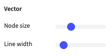

# Manage QA processes

## Use short feedback loops

The platform ensures short feedback loops through the following design choices:

1. Each sample is annotated by 1 labeler. A sample is either an individual image or point cloud, or a sequence of images, point clouds or multiple sensors, depending on the dataset settings - see [#sample](../background/main-concepts.md#sample "mention").
2. Labelers are not able to manually select samples to label first. Through the "Start Labeling" workflow, samples are presented for them.
3. After a reviewer has rejected a sample, the original labeler has to correct the rejected sample before being able to continue labeling any other samples in the queue. The rejected sample will appear in the beginning of the labeler's queue. For more details about the label queue, see [label-queue-mechanics.md](../background/label-queue-mechanics.md "mention")
4. After a labeler has corrected a rejected sample, the original reviewer has to review the corrected sample. The corrected sample will appear in the beginning of the reviewer's queue.

## Set up a linting process

Linting is the process of performing static analysis to flag erroneous patterns. For example, one would want to programmatically ...

1. Identify cuboids with unexpected dimensions or positions
2. Spot too small segmentation masks or uncover unlabeled pixels
3. Observe movement errors in sequences
4. Flag incorrect categories

Using the API/SDK & webhooks system, it is straightforward to set up such linting process and verify labels against expected properties:

* The webhooks system allows to receive event notifications whenever a sample has been labeled, such that the linting process can be triggered (see also [webhooks.md](../how-to-integrate/webhooks.md "mention"))
* The API/SDK offers a programmatic way to (see also [python-sdk-quickstart.md](../tutorials/python-sdk-quickstart.md "mention"))
  * List & pull labels
  * Verify properties for these labels
  * Change the status of labels to e.g. "Rejected"
  * Report issues&#x20;

For more details, please [contact us](https://segments.ai/contact).

## Discover additional features to improve QA

#### Work with issues

Leave comments, post screenshots or ask questions with the issues functionality. See [work-with-issues.md](work-with-issues.md "mention")

#### Review using ratings

Enable the ratings functionality in the dataset and leave star-based ratings

<figure><figcaption>
Leave star-based ratings
</figcaption></figure>

#### Add an additional QA round

Add a "Verified" label status, intended to support an additional QA round of all labels with status "Reviewed"

<figure><figcaption>
Enable ratings and add a "Verified" label status in the dataset settings
</figcaption></figure>

#### Enable validation check to warn users about unlabeled points in the 3D segmentation interface

This feature displays an alert when attempting to save if there are any unlabeled points.&#x20;

This option is only available for datasets with the "Pointcloud" data type and the "Segmentation" task.&#x20;

<figure><figcaption>
The warning is optional and can be enabled through dataset settings
</figcaption></figure>
