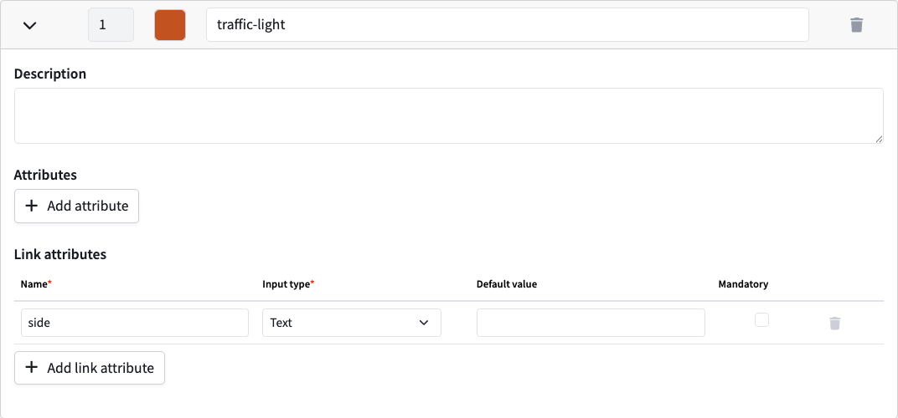

# Annotate object links (beta)

With the object linking feature you can annotate _relations_ or _links_ between objects in the scene. These links can also contain _link attributes_.

This feature is in beta. Current limitations:

* Only available in 3D labeling interfaces
* The link between two objects is only rendered for cuboids, not yet for polygons/polylines/keypoints

The format of the link annotations in the exported label attributes is documented [here](../reference/label-types.md#links).

## Enable the object linking feature

Navigate to the dataset settings and go to the "Labeling" section. At the bottom of the page, check the option "Use object linking". If the option is not present, it means that the dataset is not compatible yet (see limitations above).

## Configure link attributes

Once the feature is activated, it's possible (but not required) to configure link attributes for each category.&#x20;

Note that a link has a direction, _from_ one object _to_ another one. The attributes that will appear when annotating a link from one object to another one are determined by the _from_ category.

Link attributes can also be configured [programmatically](../reference/categories-and-attributes.md#category).

<figure><figcaption>
Link attribute configuration
</figcaption></figure>

## Link two objects and edit link attributes

The tool bar has a new button to activate the object linking tool.

<figure><figcaption>
The toolbar with the object linking tool activated
</figcaption></figure>

The below video shows how to link two objects, in this case a traffic light and a lane:

1. Select an object
2. Activate the object linking tool
3. Click on the other object you want to link it to
4. The link is now shown in the right sidebar. You can also set the link attributes here.

{% embed url="https://files.gitbook.com/v0/b/gitbook-x-prod.appspot.com/o/spaces%2FHczBG7NHgAtEe4ql1rXH%2Fuploads%2FWZWdiyFwfwPTFvDewlvU%2Foutput.mp4?alt=media&token=738e3ad5-13d7-4cc7-89de-9dbaf5644308" %}

## Unlink two objects

The following video shows how to delete a link:

1. Select the object
2. Select the object linking tool
3. Click on the other object to break the link

Alternatively a link can be deleted by clicking the trash bin icon in the sidebar next to the link.

{% embed url="https://files.gitbook.com/v0/b/gitbook-x-prod.appspot.com/o/spaces%2FHczBG7NHgAtEe4ql1rXH%2Fuploads%2F54i7hchuiS315FpQGw6W%2Foutput.mp4?alt=media&token=a61385bb-88c9-40e0-a323-0ca584d0f7f2" %}

<figure><figcaption></figcaption></figure>
