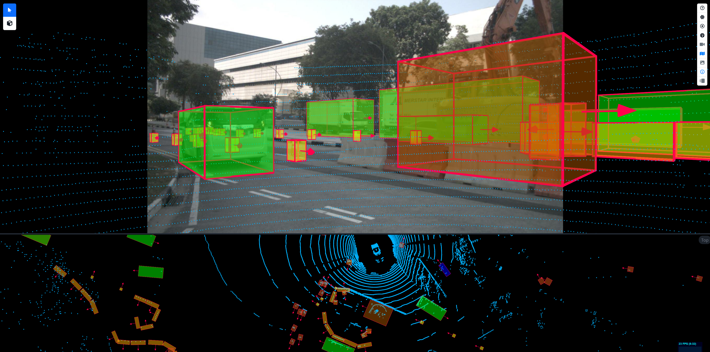
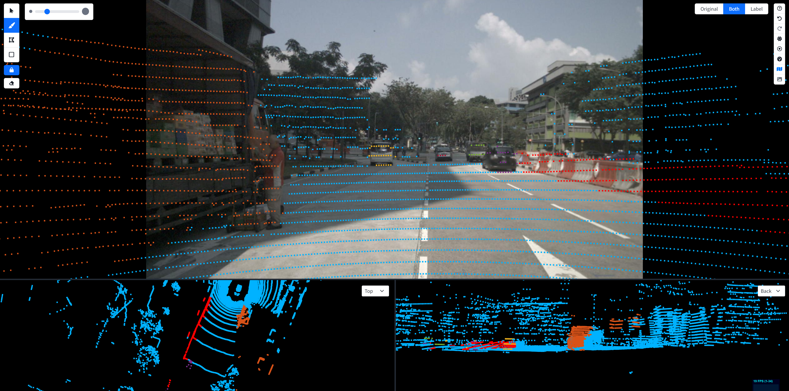

# Upload, view, and overlay images


See the [view-and-navigate-in-the-3d-interface.md](view-and-navigate-in-the-3d-interface.md "mention") page on specific 3D navigation principles


## Upload images along with point clouds

See [#camera-image](../../reference/sample-types/#camera-image "mention") for information on how to upload camera images with or without camera intrinsincs/extrinsics along with point clousd

## View synced camera images

If you uploaded one or more camera images to your sample, you can view them directly in the interface, or in a separate browser tab (which you can e.g. move to a second screen).

* Toggle the synced images in the interface by clicking on the image icon in the right toolbar, or by pressing the hotkey (`q` by default).
* Display the synced images in a separate tab by holding `Ctrl/Cmd` and clicking the image icon in the right toolbar, or by right-clicking the image icon and click "Open in new tab" or "Open in new window".

When viewing the synced images, you can enlarge them as follows:

* To zoom in on a synced image, double-click the image.&#x20;
* To move the zoomed-in image, click and drag on the image.&#x20;
* To reset the zoom of an image, double-click the image again.

<figure><figcaption></figcaption></figure>

## Display a camera image behind the point cloud

If you uploaded one or more **calibrated** camera images to your sample, you can display a calibrated camera image behind the point cloud in the main point cloud viewer.

1. View the synced images.
2. Hover over the image you want to display in the main viewer. A camera button pops up in the top right of the image.
3. Press the camera button.

<figure><figcaption>
Example for 3D cuboid interface
</figcaption></figure>

<figure><figcaption>
Example for 3D segmentation interface
</figcaption></figure>

