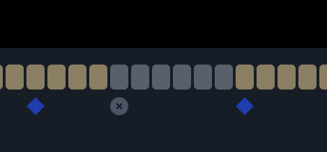

# Use keyframe interpolation

**Keyframe interpolation** is the process of creating intermediate values between a set of keyframes. The keyframes are specified by you and then the values in the frames between the keyframes are automatically filled in.

In Segments.ai, keyframe interpolation is used for object labels that change over time. For example, in a sequence with a moving car, the bounding box around the car moves in each frame. With keyframe interpolation, you only need to specify the label at certain key times, and the intermediate labels will be created automatically.


Keyframe interpolation is available for 2D bounding box labels, and for 3D cuboid labels.&#x20;



#### [Object attributes](../../reference/label-types.md#object-attributes) and interpolation

Editing an object-level attribute will create a new keyframe, and attribute values are copied between keyframes. This means that if you edit an object-level attribute, its value will be copied until the next existing keyframe.

If want to change an attribute of an object with existing keyframes, make sure to change the value on **all** necessary keyframes.


## View the keyframes of an object

In the context of interpolation, a **keyframe** is a marker that indicates that at that frame, the state of the object is defined by the user. In other frames (that are not keyframes), the state of the object label is calculated automatically through interpolation.&#x20;

1. Select the object.
2. The keyframes are now visible in the timeline at the bottom of the editor. A normal keyframe is shown as a blue diamond under the frame it belongs to.

.png>)

## Add a keyframe

### In the current frame

1. Select the object.
2. Make a change to the object in the editor. A keyframe containing the new changes is added automatically.

### In a different frame

1. Select the object.
2. In the timeline, double-click the space under the frame where you want to add a keyframe. The keyframe captures the state of the object label at that frame. This means the object will not change.

## Move a keyframe

1. Select the object.
2. In the timeline, click and drag the keyframe. When you release your mouse, the changes will be applied and the interpolation will be recalculated.

## Remove a keyframe

1. Select the object.
2. In the timeline, click the keyframe you want to remove.
3. Press the `Backspace` key to remove the keyframe. The interpolation will be recalculated immediately.


When there exists only one keyframe, this keyframe cannot be removed.


## View the remove-keyframes of an object

A remove-keyframe is a visual indication of where an object was removed from the sample. A remove-keyframe means that the object is not present in that frame and all frames before the next normal keyframe.&#x20;

1. Select the object.
2. The delete-keyframes are now visible in the timeline at the bottom of the editor. A delete-keyframe is indicated as a grey circle with a cross.

 (1).png>)

## Add a remove-keyframe

1. Select the object.
2. Remove the object from the current frame (see [Use the labeling interfaces](broken-reference)). A remove-keyframe is added automatically.

## Move a remove-keyframe

1. Select the object.
2. In the timeline, click and drag the remove-keyframe. When you release your mouse, the changes will be applied.

## Remove a remove-keyframe

1. Select the object.
2. In the timeline, click the remove-keyframe you want to remove.
3. Press the `Backspace` key to remove the remove-keyframe. The interpolation will be recalculated immediately.

## Label occluded objects

Sometimes an object might be occluded, in which case you might want the object to not be present in certain frames and reappear in other frames. There are several ways to obtain this.

One procedure is to ...

1. Label a cuboid
2. Adjust the cuboid on the first frame where it _reappears_. This will create a keyframe.
3. Remove the cuboid on the first frame where it _starts being occluded_. The removal will carry through to the next keyframe which is the first frame where it reappears.

Another procedure is to ...

1. Label a cuboid
2. Remove the cuboid in the first frame where it _starts being occluded_.
3. Label a _new_ cuboid in the first frame where it _reappears_
4. Change the track ID of the _new_ cuboid into the track ID of the initial cuboid. This will merge both cuboids together on a single track.

<figure><figcaption></figcaption></figure>
