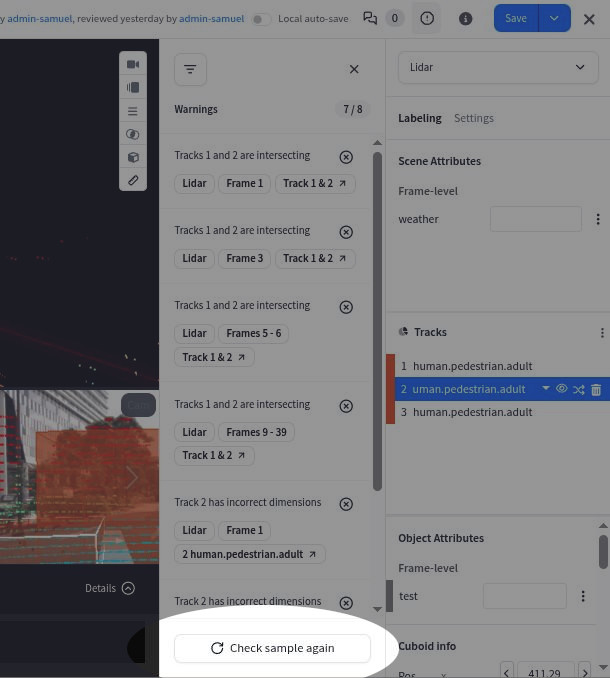
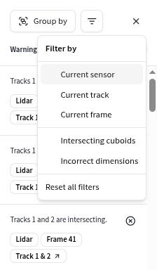
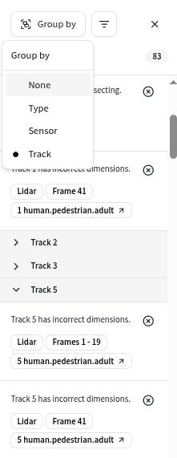
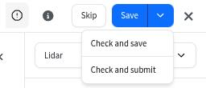
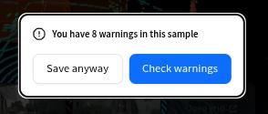

# Use the warning system


[More info about how to configure rules for a dataset](../guides/configure-label-editor/configure-rules.md)


When in a labeling / reviewing interface, you can open the warnings sidebar from the navigation bar by clicking the warnings icon.

<figure><figcaption></figcaption></figure>

When the warnings sidebar is opened, you can click "Check sample" to verify the annotations with the configured rules. The resulting warnings will be displayed in the overview.

<figure><figcaption></figcaption></figure>

&#x20;Triggering the check to run again can be done using the button at the bottom of the sidebar.

<figure><figcaption></figcaption></figure>

In the warning list, you can see an overview of the potential issues.&#x20;

<figure><figcaption></figcaption></figure>

Individual warnings can be dismissed by clicking the 'x' icon on the top right of a warning. Re-running the check will re-add any dismissed warnings if they are still present in the sample.

To quickly jump to the context of a warning, you can click on the last pill button (e.g. "Track 1 & 2" in the image above). This will update the current sensor, frame and track to match the warning.

To facilitate going through the set of warnings and treating them in an organised manner, you can filter the list to only display warnings matching the current sensor / frame / active object, or filter to display only a specific warning type.

<figure><figcaption></figcaption></figure>

In addition to this, you can also group the warnings by type, sensor, or track. The grouping can be combined with an active filter to fully tailor the warning list to your needs. &#x20;

<figure><figcaption></figcaption></figure>

## Save flow

The save / submit / review flow now allows you to run the check before saving.

 

If warnings are found, a prompt will ask you whether you want to proceed anyway, or if you want to check the warnings by opening the sidebar.

<figure><figcaption></figcaption></figure>

