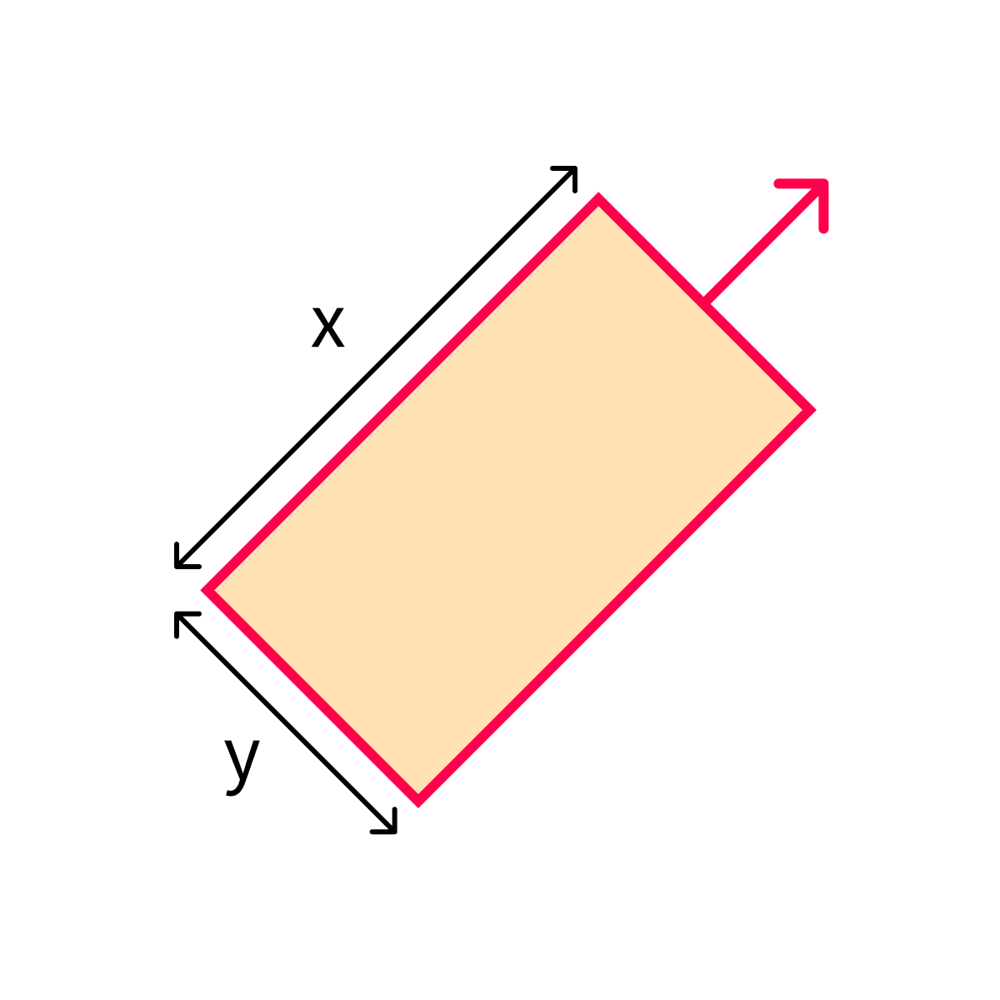
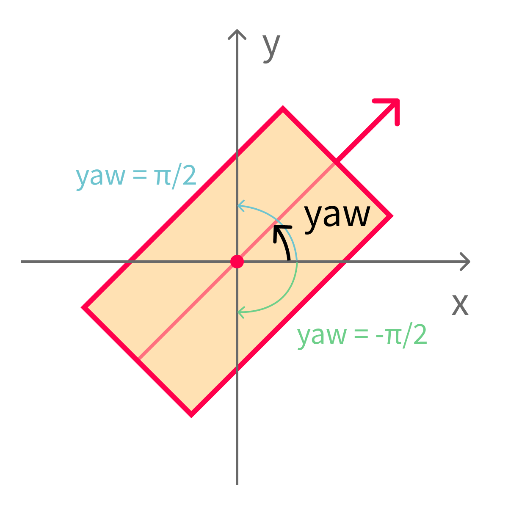

# Label formats

When you label a sample and press the save button, you've created a [label](../background/main-concepts.md#label) for that sample. Labels come in different types, with the available options determined by the type of the corresponding sample.&#x20;

When downloading or uploading labels using the [Python SDK](../python-sdk.md), the format of the `attributes` field depends on the type of label. The different formats are described here.

A label can additionally also contain [#object-attributes](label-types.md#object-attributes "mention") and [#image-attributes](label-types.md#image-attributes "mention").

## Image

### Segmentation labels

Format of the `attributes` field in [`client.get_label()`](../python-sdk.md#get-a-label):

```javascript
{
  "format_version": "0.1",
  "annotations": [
    {
      "id": 1, // this is an object id. Should be > 0.
      "category_id": 1 // this is a category id
    },
    {
      "id": 2, 
      "category_id": 1
    },
    {
      "id": 3, 
      "category_id": 4
    }
  ],
  "segmentation_bitmap": {
    "url": "https://segmentsai-staging.s3.eu-west-2.amazonaws.com/assets/davy/ddf55e99-1a6f-42d2-83e9-8657de3259a1.png"
  }
}
```


The`segmentation_bitmap_url`refers to a 32-bit RGBA png image which contains the segmentation masks. The alpha channel is set to 255, and the remaining 24-bit values in the RGB channels correspond to the object ids in the `annotations` list. Unlabeled regions should have a value of 0. Because of the large dynamic range, **these png images may appear black in an image viewer.**



**When downloading a label**, you can use the utility function `utils.load_label_bitmap_from_url(url)` in the Python SDK to load the label bitmap as a numpy array containing object ids.

**When uploading a label**, the easiest way to transform a segmentation bitmap into this format and upload it is by using the util function`bitmap2file`:

```python
from segments.utils import bitmap2file

# segmentation_bitmap is a numpy array of type np.uint32, with values corresponding to instance_ids
file = bitmap2file(segmentation_bitmap)
asset = client.upload_asset(file, "label.png")
segmentation_bitmap_url = asset["url"]
```

For a full example of uploading model-generated labels to Segments.ai, please refer to [this blogpost](https://segments.ai/blog/speed-up-image-segmentation-with-model-assisted-labeling).


### Vector labels (bounding box, polygon, polyline, keypoint)

Format of the `attributes` field in [`client.get_label()`](../python-sdk.md#get-a-label):

```javascript
{
  "format_version": "0.1",
  "annotations": [
    {
      "id": 1, // the object id
      "category_id": 1, // the category id
      "type": "bbox", // refers to the annotation type (bounding box)
      "points": [
        [12.34, 56.78], // x0, y0 (upper left corner of bbox)
        [90.12, 34.56]  // x1, y1 (lower right corner of bbox)
      ]
    },
    {
      "id": 2,
      "category_id": 2,
      "type": "polygon", // refers to the annotation type (polygon)
      "points": [
        [12.34, 56.78], // x0, y0 (starting point of the polygon)
        [90.12, 34.56], // x1, y1
        [78.91, 23.45], // x2, y2
        [67.89, 98.76], // x3, y3
        [54.32, 10.01]  // x4, y4
      ]
    },
    {
      "id": 3, 
      "category_id": 3,
      "type": "polyline", // refers to the annotation type (polyline)
      "points": [
        [12.34, 56.78], // x0, y0 (starting point of the polyline)
        [90.12, 34.56], // x1, y1
        [78.91, 23.45], // x2, y2
        [67.89, 98.76], // x3, y3
        [54.32, 10.01]  // x4, y4
      ]
    },
    {
      "id": 4,
      "category_id": 4,
      "type": "point", // refers to the annotation type (keypoint)
      "points": [
        [12.34, 56.78] // x, y (coordinates of keypoint)
      ]
    },
  ],
}
```

## Image sequence

### Segmentation labels

Coming soon.

### Vector labels (bounding box, polygon, polyline, keypoint)

Format of the `attributes` field in [`client.get_label()`](../python-sdk.md#get-a-label):

```jsonp
{
  "format_version": "0.2",
  "frames": [
    { ... },
    { ... },
    { ... }
  ]
}
```

Where each frames object has the following format:

```jsonp
{
  "format_version": "0.1",
  "timestamp": "00001", // this field is only included if the sample has a timestamp
  "annotations": [
    {
      "id": 1, // the object id
      "category_id": 1, // the category id
      "track_id": 6, // this id is used to links objects across frame
      "is_keyframe": true, // whether this frame is a keyframe
      "type": "bbox", // refers to the annotation type (bounding box)
      "points": [
        [12.34, 56.78], // x0, y0 (upper left corner of bbox)
        [90.12, 34.56]  // x1, y1 (lower right corner of bbox)
      ]
    },
    {
      "id": 2,
      "category_id": 2,
      "track_id": 5, // this id is used to links objects across frame
      "is_keyframe": true, // whether this frame is a keyframe
      "type": "polygon", // refers to the annotation type (polygon)
      "points": [
        [12.34, 56.78], // x0, y0 (starting point of the polygon)
        [90.12, 34.56], // x1, y1
        [78.91, 23.45], // x2, y2
        [67.89, 98.76], // x3, y3
        [54.32, 10.01]  // x4, y4
      ]
    },
    {
      "id": 3, 
      "category_id": 3,
      "track_id": 4, // this id is used to links objects across frame
      "is_keyframe": true, // whether this frame is a keyframe
      "type": "polyline", // refers to the annotation type (polyline)
      "points": [
        [12.34, 56.78], // x0, y0 (starting point of the polyline)
        [90.12, 34.56], // x1, y1
        [78.91, 23.45], // x2, y2
        [67.89, 98.76], // x3, y3
        [54.32, 10.01]  // x4, y4
      ]
    },
    {
      "id": 4,
      "category_id": 4,
      "track_id": 3, // this id is used to links objects across frame
      "is_keyframe": true, // whether this frame is a keyframe
      "type": "point", // refers to the annotation type (keypoint)
      "points": [
        [12.34, 56.78] // x, y (coordinates of keypoint)
      ]
    },
  ],
}
```

## 3D point cloud

### Segmentation label

The annotations array contains the different objects ("annotations") in the label with their category (the `category_id` should correspond to an id defined in the [categories](categories-and-task-attributes.md#categories)).

The `point_annotations` array contains the object/annotation id for each point in the point cloud. The order of the ids in this array is the same as the order of the points in the point cloud.

```json
{
  "format_version": "0.1",
  "annotations": [
    {
      "id": 1, // the object id
      "category_id": 1 // the category id
    },
    {
      "id": 2, 
      "category_id": 1
    },
    {
      "id": 3, 
      "category_id": 4
    }
  ],
  "point_annotations": [0, 0, 0, 3, 2, 2, 2, 1, 3...], // refers to object ids
}
```

### Cuboid label

```jsonp
{
  "format_version": "0.2",
  "annotations": [
    {
      "id": 1,
      "category_id": 1,
      "type": "cuboid",
      "position": {
        "x": 0.0,
        "y": 0.2,
        "z": 0.5
      },
      "dimensions": {
        "x": 1.2,
        "y": 1,
        "z": 1
      },
      "yaw": 1.63,
      "track_id": 1,  // only in sequences
      "is_keyframe": true,  // only in sequences
      "index": 0,  // only in sequences 
    }
  ]
}
```

| Name             | Type                                                              | Description                     |
| ---------------- | ----------------------------------------------------------------- | ------------------------------- |
| `format_version` | `string`                                                          | Format version.                 |
| `annotations`    | `array` of [cuboid annotations](label-types.md#cuboid-annotation) | List of the cuboid annotations. |

### Cuboid annotation

A cuboid annotation represents a single cuboid in a point cloud (frame).

```json
{
  "id": 1,
  "category_id": 1,
  "type": "cuboid",
  "position": {
    "x": 0.0,
    "y": 0.2,
    "z": 0.5
  },
  "dimensions": {
    "x": 1.2,
    "y": 1,
    "z": 1
  },
  "yaw": 0.63,
  "rotation": {
    "qx": 0,
    "qy": 0.0491566,
    "qz": 0.3096865,
    "qw": 0.9495672
  },
  "track_id": 1,  // only in sequences
  "is_keyframe": true,  // only in sequences
  "index": 0,  // only in sequences 
}
```

| Name          | Type                                                                                                                                                                     | Description                                                                                                                                                                                                                                                                              |
| ------------- | ------------------------------------------------------------------------------------------------------------------------------------------------------------------------ | ---------------------------------------------------------------------------------------------------------------------------------------------------------------------------------------------------------------------------------------------------------------------------------------- |
| `id`          | `integer`                                                                                                                                                                | Object id.                                                                                                                                                                                                                                                                               |
| `category_id` | `integer`                                                                                                                                                                | Category id.                                                                                                                                                                                                                                                                             |
| `type`        | `string`                                                                                                                                                                 | Object type, which is always "cuboid" for cuboid annotations.                                                                                                                                                                                                                            |
| `position`    | <p><code>object</code>: {<br>    "x": <code>float</code>,<br>    "y": <code>float</code>,<br>    "z": <code>float</code><br>}</p>                                        | XYZ position of the center of the cuboid in world coordinates.                                                                                                                                                                                                                           |
| `dimensions`  | <p><code>object</code>: {<br>    "x": <code>float</code>,<br>    "y": <code>float</code>,<br>    "z": <code>float</code><br>}</p>                                        | Dimensions of the cuboid. "x" corresponds to the length, "y" to the width, and "z" to the height. See diagram 1.                                                                                                                                                                         |
| `yaw`         | `float`                                                                                                                                                                  | Cuboid rotation along the z-axis in radians between \[-π, π]. 0 yaw corresponds to a cuboid aligned with the x-axis pointing to increasing x-values. The yaw value increases with a counter-clockwise rotation up to π, and decreases with a clockwise rotation up to -π. See diagram 2. |
| `rotation`    | <p><code>object</code>: {<br>    "qx": <code>float</code>,<br>    "qy": <code>float</code>,<br>    "qz": <code>float</code>,</p><p>    "qw": <code>float</code><br>}</p> | Cuboid rotation defined as a [rotation quaternion](https://danceswithcode.net/engineeringnotes/quaternions/quaternions.html). Only available when 3D rotation is enabled in the dataset settings (under "Labeling").                                                                     |
| `track_id`    | `integer`                                                                                                                                                                | Track ID of the object. This ID is used to track an object over multiple frames. Only relevant for sequences.                                                                                                                                                                            |
| `is_keyframe` | `boolean`                                                                                                                                                                | Whether this cuboid annotation is a keyframe or an interpolated frame. Only relevant for sequences.                                                                                                                                                                                      |
| `index`       | `integer`                                                                                                                                                                | The frame index. Only relevant for sequences.                                                                                                                                                                                                                                            |

<div>



 

<figure><figcaption><p>Diagram 2: yaw rotation of a cuboid. The red arrow shows the cuboid heading. yaw = π/2 corresponds to a heading in the direction of increasing y values, while yaw = -π/2 corresponds to a heading in the direction of decreasing y values.</p></figcaption></figure>

</div>

### Vector label (polygon, polyline, keypoint)

```json
  "format_version": "0.1",
  "annotations": [
    {
      "id": 2,
      "category_id": 2,
      "type": "polygon", // refers to the annotation type (polygon)
      "points": [
        [12.34, 56.78, 0], // x0, y0, z0 (starting point of the polygon)
        [90.12, 34.56, 0], // x1, y1, z1
        [78.91, 23.45, 0], // x2, y2, z2
        [67.89, 98.76, 0], // x3, y3, z3
        [54.32, 10.01, 0]  // x4, y4, z4
      ],
      "track_id": 2, // only in sequences
      "is_keyframe": true, // only in sequences
      "index": 0 // only in sequences 
    },
    {
      "id": 3, 
      "category_id": 3,
      "type": "polyline", // refers to the annotation type (polyline)
      "points": [
        [12.34, 56.78, 0], // x0, y0, z0 (starting point of the polyline)
        [90.12, 34.56, 0], // x1, y1, z1
        [78.91, 23.45, 0], // x2, y2, z2
        [67.89, 98.76, 0], // x3, y3, z3
        [54.32, 10.01, 0]  // x4, y4, z4
      ],
      "track_id": 1, // only in sequences
      "is_keyframe": false, // only in sequences
      "index": 1 // only in sequences 
    },
    {
      "id": 4,
      "category_id": 4,
      "type": "point", // refers to the annotation type (keypoint)
      "points": [
        [12.34, 56.78, 0] // x, y, z (coordinates of keypoint)
      ],
      "track_id": 3, // only in sequences
      "is_keyframe": false, // only in sequences
      "index": 2 // only in sequences 
    }
  ]
}
```

## 3D point cloud sequence

### Segmentation label

```jsonp
{
  "format_version": "0.2",
  "frames": [
    { ... },
    { ... },
    { ... }
  ]
}
```

Where each frames object has the following format:

```jsonp
{
  "format_version": "0.2",
  "annotations": [
    {
      "id": 1, // the object id
      "category_id": 1, // the category id
      "track_id": 3 // this id is used to link objects across frames
    },
    {
      "id": 2, 
      "category_id": 1,
      "track_id": 4
    },
    {
      "id": 3, 
      "category_id": 4,
      "track_id": 5
    },
  ],
  "point_annotations": [0, 0, 0, 3, 2, 2, 2, 1, 3...], // refers to object ids
}
```

### Cuboid label

```jsonp
{
  "format_version": "0.2",
  "frames": [
    { ... },
    { ... },
    { ... }
  ]
}
```

| Name             | Type                                                     |                                                        |
| ---------------- | -------------------------------------------------------- | ------------------------------------------------------ |
| `format_version` | `string`                                                 | Format version.                                        |
| `frames`         | `array` of [cuboid labels](label-types.md#cuboid-labels) | List of cuboid labels (one per frame in the sequence). |

### Vector label (polygon, polyline, keypoint)

Format of the `attributes` field in [`client.get_label()`](../python-sdk.md#get-a-label):

```json
{
  "format_version": "0.2",
  "frames": [
    { ... },
    { ... },
    { ... }
  ]
}
```

| Name             | Type                                                                              |                                                        |
| ---------------- | --------------------------------------------------------------------------------- | ------------------------------------------------------ |
| `format_version` | `string`                                                                          | Format version.                                        |
| `frames`         | `array` of [vector labels](label-types.md#vector-label-polygon-polyline-keypoint) | List of vector labels (one per frame in the sequence). |

## Text

### Named entity recognition

Format of the `attributes` field in [`client.get_label()`](../python-sdk.md#get-a-label):

```json
{
    "format_version": "0.1",
    "annotations": [
        {
            "start": 0, // the first character index of the label
            "end": 5, // the last character index of the the label (exclusive)
            "category_id": 1 // the category id
        },
        {
            "start": 7, 
            "end": 12, 
            "category_id": 0
        },
        {
            "start": 20, 
            "end": 30, 
            "category_id": 2
        },
    ]
}
```

### Span categorization

Format of the `attributes` field in [`client.get_label()`](../python-sdk.md#get-a-label):

```json
{
    "format_version": "0.1",
    "annotations": [
        {
            "start": 0, // the first character index of the label
            "end": 5, // the last character index of the the label (exclusive)
            "category_id": 1 // the category id
        },
        {
            "start": 7, 
            "end": 12, 
            "category_id": 0
        },
        {
            "start": 20, 
            "end": 30, 
            "category_id": 2
        },
    ]
}
```

## Object attributes

Objects in the annotations list can optionally also contain an attributes field to store object-level attributes. Make sure to properly [configure the label editor](../configure-label-editor.md) if you're using object-level attributes.

```javascript
{
  "format_version": "0.1",
  "annotations": [
    {
      "id": 1, 
      "category_id": 1,
      "attributes": { // object-level attributes
        "is_crowd": "1",
        "color": "red"
      }
    },
    {
      "id": 2, 
      "category_id": 1,
      "attributes": {
        "is_crowd": "0",
        "color": "blue"
      }
    },
    {
      "id": 3, 
      "category_id": 4,
      "attributes": {
        "is_crowd": "1",
        "color": "yellow"
      }
    }
  ],
  ...
}
```

## Image attributes

You can also define image-level attributes. These can be useful in image classification tasks. Make sure to properly [configure the label editor](../configure-label-editor.md) if you're using image-level attributes.

```javascript
{
  "format_version": "0.1",
  "annotations": [...],
  "image_attributes": { // sample-level attributes
    "scene_type": "crossroads",
    "weather": "sunny"
  }
}
```
