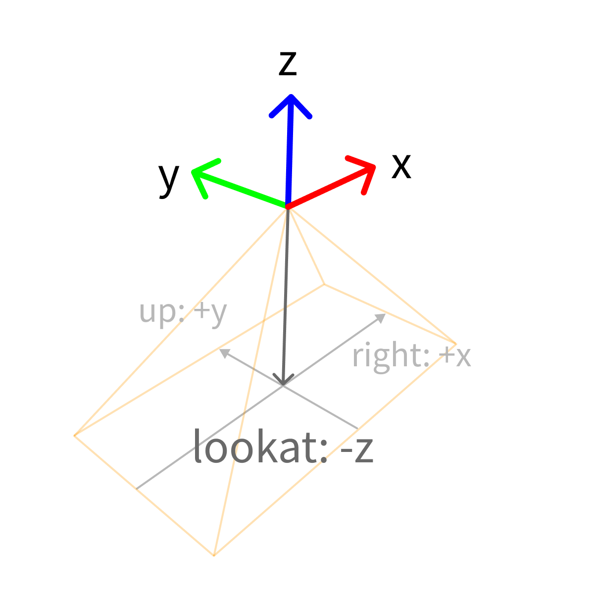

# Sample formats

A [sample](../../background/main-concepts.md#sample) is a data point you want to label. Samples come in different types, like an image, a 3D point cloud, or a video sequence. When uploading ([`client.add_sample()`](../../python-sdk.md#create-a-sample)) or downloading ([`client.get_sample()`](../../python-sdk.md#get-a-sample)) a sample using the [Python SDK](../../python-sdk.md), the format of the `attributes` field depends on the type of sample. The different formats are described here.


The section [import-data](../../how-to-integrate/import-data/ "mention") shows how you can obtain URLs for your assets.


## Image

Supported image formats:  jpeg, png, bmp.

```json
{
    "image": {
        "url": "https://example.com/image.jpg"
    }
}
```


If the image file is on your local computer, you should first upload it to our asset storage service (using [`upload_asset()`](https://sdkdocs.segments.ai/en/latest/client.html#upload-an-asset-to-segments-s3-bucket)) or to another cloud storage service.


## Image sequence

Supported image formats:  jpeg, png, bmp.

```json
{ 
  "frames": [
    {
      "image": {
        "url": "https://example.com/frame_00001.jpg"
      },
      "name": "frame_00001" // optional
    },
    {
      "image": {
        "url": "https://example.com/frame_00002.jpg"
      },
      "name": "frame_00002"
    },
    {
      "image": {
        "url": "https://example.com/frame_00003.jpg"
      },
      "name": "frame_00003"
    }
  ]
} 
```

## 3D point cloud


On Segments.ai, the up direction is defined along the z-axis, i.e. the vector (0, 0, 1) points up. If you upload point clouds with a different up direction, you might have trouble navigating the point cloud.


```json
{
    "pcd": {
        "url": "https://example.com/pointcloud.bin",
        "type": "kitti"
    },
    "images": [
        { ... },
        { ... },
        { ... }
    ], // optional
    "name": "frame_00001", // optional
    "timestamp": "00001", // optional
    "ego_pose": {
        "position": {
            "x": -2.7161461413869947,
            "y": 116.25822288149078,
            "z": 1.8348751887989483
        },
        "heading": {
            "qx": -0.02111296123795955,
            "qy": -0.006495469416730261,
            "qz": -0.008024565904865688,
            "qw": 0.9997181192298087
        }
    },
    "default_z": -1 // optional, 0 by default
}
```

| Name        | Type                                        | Description                                                                                                                                                                                                                                               |
| ----------- | ------------------------------------------- | --------------------------------------------------------------------------------------------------------------------------------------------------------------------------------------------------------------------------------------------------------- |
| `pcd`       | [Point cloud data](./#undefined)            | **Required.** Point cloud data.                                                                                                                                                                                                                           |
| `images`    | `array` of [camera images](./#camera-image) | Reference camera images.                                                                                                                                                                                                                                  |
| `name`      | `string`                                    | Name of the sample.                                                                                                                                                                                                                                       |
| `timestamp` | `string`                                    | Timestamp of the sample.                                                                                                                                                                                                                                  |
| `ego_pose`  | [Ego pose](./#ego-pose)                     | Pose of the sensor that captured the point cloud data.                                                                                                                                                                                                    |
| `default_z` | `float`                                     | Default z-value of the ground plane. 0 by default. Only valid in the point cloud cuboid editor. New cuboids will be drawn on top of the ground plane, i.e. the default z-position of a new cuboid is 0.5 (since the default height of a new cuboid is 1). |

### Point cloud data

See [3D point cloud formats](supported-file-formats.md#3d-point-cloud) for the supported file formats.

```json
{
    "url": "https://example.com/pointcloud.bin",
    "type": "kitti"
}
```

| Name   | Type                                                                        | Description                                                                                                                                                                |
| ------ | --------------------------------------------------------------------------- | -------------------------------------------------------------------------------------------------------------------------------------------------------------------------- |
| `url`  | `string`                                                                    | **Required.** URL of the point cloud data.                                                                                                                                 |
| `type` | `string`: "pcd" \| "binary-xyzi" \| "kitti" \| "binary-xyzir" \| "nuscenes" | **Required.** Type of the point cloud data. See [#3d-point-cloud](supported-file-formats.md#3d-point-cloud "mention") file formats for the list of supported file formats. |


If the point cloud file is on your local computer, you should first upload it to our asset storage service (using [`upload_asset()`](https://sdkdocs.segments.ai/en/latest/client.html#upload-an-asset-to-segments-s3-bucket)) or to another cloud storage service.


### Camera image

A calibrated or uncalibrated reference image corresponding to a point cloud. The reference images can be opened in a new tab from within the labeling interface. You can determine the layout of the images by setting the `row` and `col` attributes on each image. If you also supply the calibration parameters, the main point cloud view can be set to the image to obtain a fused view. In this case, your image should be rectified before uploading.

```json
{
    "url": "https://example.com/image.jpg",
    "row": 0,
    "col": 0,
    "intrinsics": { // optional
        "intrinsic_matrix": [
            [1266.417203046554, 0, 816.2670197447984],
            [0, 1266.417203046554, 491.50706579294757],
            [0, 0, 1]
        ]
    },
    "extrinsics": { // optional
        "translation": {
            "x": -0.012463384576629082,
            "y": 0.76486688894964,
            "z": -0.3109103442096661
        },
        "rotation": {
            "qx": 0.713640516187247,
            "qy": -0.001134052598226082,
            "qz": 0.0036449450274057696,
            "qw": 0.7005017073187271
        }
    }
}
```

| Name         | Type                                      | Description                                                                 |
| ------------ | ----------------------------------------- | --------------------------------------------------------------------------- |
| `url`        | `string`                                  | **Required.** URL of the camera image.                                      |
| `row`        | `int`                                     | **Required.** Row of this image in the images viewer.                       |
| `col`        | `int`                                     | **Required.** Column of this image in the images viewer.                    |
| `intrinsics` | [Camera intrinsics](./#camera-intrinsics) | Intrinsic parameters of the camera.                                         |
| `extrinsics` | [Camera extrinsics](./#undefined)         | Extrinsic parameters of the camera relative to the [ego pose](./#ego-pose). |


If the image file is on your local computer, you should first upload it to our asset storage service (using [`upload_asset()`](https://sdkdocs.segments.ai/en/latest/client.html#upload-an-asset-to-segments-s3-bucket)) or to another cloud storage service.


#### Camera intrinsics

```json
{
    "intrinsic_matrix": [
        [1266.417203046554, 0, 816.2670197447984],
        [0, 1266.417203046554, 491.50706579294757],
        [0, 0, 1]
    ]
}
```

| Name               | Type                                                                    | Description                                                                                                                                                                                                                                                                                                                                                                                                                                                                                                                                                                                         |
| ------------------ | ----------------------------------------------------------------------- | --------------------------------------------------------------------------------------------------------------------------------------------------------------------------------------------------------------------------------------------------------------------------------------------------------------------------------------------------------------------------------------------------------------------------------------------------------------------------------------------------------------------------------------------------------------------------------------------------- |
| `intrinsic_matrix` | 2D `array` of `float`s representing 3x3 matrix $$K$$in row-major order​ | <p><strong>Required.</strong> Intrinsic matrix <span class="math">K</span> used in the pinhole camera model.<br><span class="math">K = \begin{bmatrix} f_x &#x26; 0 &#x26; o_x\\ 0 &#x26; f_y &#x26; o_y \\ 0 &#x26; 0 &#x26; 1 \end{bmatrix}</span></p><p>​<span class="math">f_x</span> and <span class="math">f_y</span>​ are the focal lengths in pixels. We assume square pixels, so <span class="math">f_x = f_y</span>​. <span class="math">o_x</span> and <span class="math">o_y</span> are the offsets (in pixels) of the principal point from the top-left corner of the image frame.</p> |

#### Camera extrinsics

```json
{
    "translation": {
        "x": -0.012463384576629082,
        "y": 0.76486688894964,
        "z": -0.3109103442096661
    },
    "rotation": {
        "qx": 0.713640516187247,
        "qy": -0.001134052598226082,
        "qz": 0.0036449450274057696,
        "qw": 0.7005017073187271
    }
}
```

| Name          | Type                                                                                                                                                                     | Description                                                                                                                                                                                                                                                                                                                                                                                                                                                                                                                   |
| ------------- | ------------------------------------------------------------------------------------------------------------------------------------------------------------------------ | ----------------------------------------------------------------------------------------------------------------------------------------------------------------------------------------------------------------------------------------------------------------------------------------------------------------------------------------------------------------------------------------------------------------------------------------------------------------------------------------------------------------------------- |
| `translation` | <p><code>object</code>: {<br>    "x": <code>float</code>,<br>    "y": <code>float</code>,<br>    "z": <code>float</code><br>}</p>                                        | **Required.** Translation of the camera in lidar coordinates, i.e., relative to the [ego pose](./#ego-pose).                                                                                                                                                                                                                                                                                                                                                                                                                  |
| `rotation`    | <p><code>object</code>: {<br>    "qx": <code>float</code>,<br>    "qy": <code>float</code>,<br>    "qz": <code>float</code>,</p><p>    "qw": <code>float</code><br>}</p> | **Required.** Rotation of the camera in lidar coordinates, i.e., relative to the [ego pose](./#ego-pose). Defined as a [rotation quaternion](https://danceswithcode.net/engineeringnotes/quaternions/quaternions.html). We use the OpenGL/Blender coordinate convention for cameras. +X is right, +Y is up, and +Z is pointing back and away from the camera. -Z is the look-at direction. Other codebases may use the OpenCV convention, where the Y and Z axes are flipped but the +X axis remains the same. See diagram 1. |

<figure><figcaption><p>Diagram 1: camera convention for calibrated camera images on Segments.ai.</p></figcaption></figure>

### Ego pose

The pose of the sensor used to capture the 3D point cloud data. This can be helpful if you want to obtain cuboids in world coordinates, or when your sensor is moving. In the latter situation, supplying an ego pose with each frame will ensure that static objects do not move when switching between frames.

```json
{
    "position": {
        "x": -2.7161461413869947,
        "y": 116.25822288149078,
        "z": 1.8348751887989483
    },
    "heading": {
        "qx": -0.02111296123795955,
        "qy": -0.006495469416730261,
        "qz": -0.008024565904865688,
        "qw": 0.9997181192298087
    }
},
```

| Name       | Type                                                                                                                                                                     | Description                                                                                                                                            |
| ---------- | ------------------------------------------------------------------------------------------------------------------------------------------------------------------------ | ------------------------------------------------------------------------------------------------------------------------------------------------------ |
| `position` | <p><code>object</code>: {<br>    "x": <code>float</code>,<br>    "y": <code>float</code>,<br>    "z": <code>float</code><br>}</p>                                        | **Required.** XYZ position of the sensor in world coordinates.                                                                                         |
| `heading`  | <p><code>object</code>: {<br>    "qx": <code>float</code>,<br>    "qy": <code>float</code>,<br>    "qz": <code>float</code>,</p><p>    "qw": <code>float</code><br>}</p> | **Required.** Orientation of the sensor. Defined as a [rotation quaternion](https://danceswithcode.net/engineeringnotes/quaternions/quaternions.html). |

## 3D point cloud sequence

```json
{ 
  "frames": [
    { ... },
    { ... },
    { ... }
  ]
} 
```

| Name     | Type                                            | Description                                                  |
| -------- | ----------------------------------------------- | ------------------------------------------------------------ |
| `frames` | `array` of [3D point clouds](./#3d-point-cloud) | **Required.** List of 3D point cloud frames in the sequence. |

## Text

```json
{ 
    "text": "Example text sample." 
}
```

| Name   | Type     | Description              |
| ------ | -------- | ------------------------ |
| `text` | `string` | **Required.** Text data. |


To upload text samples in bulk, see [file formats](supported-file-formats.md#text).

